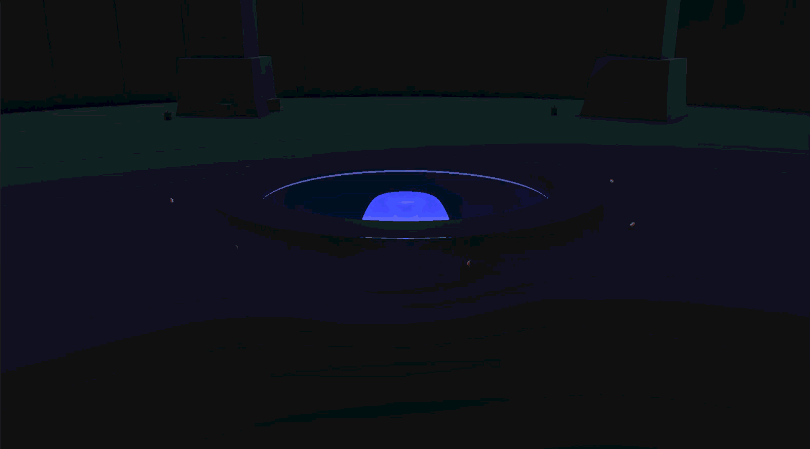
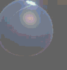
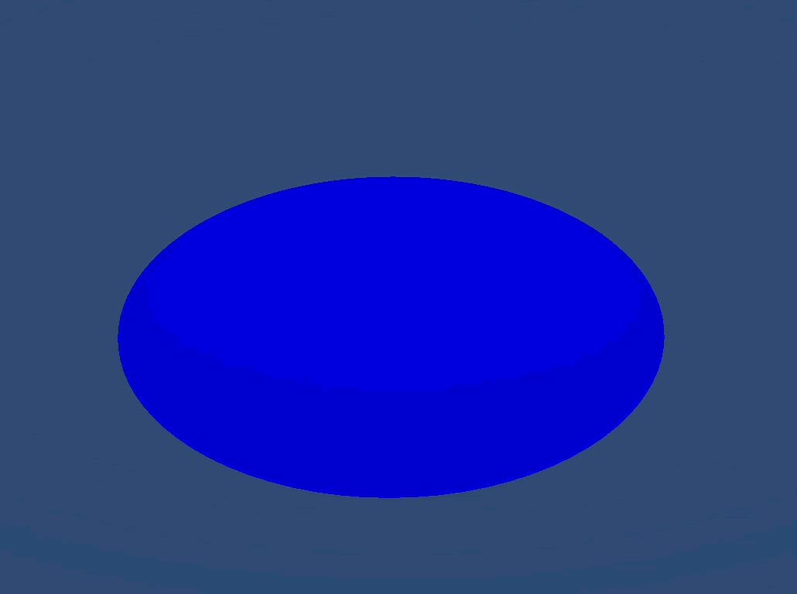

# VFX Graph: Eyes of Shadow

A comprehensive Unity visual effects project demonstrating advanced particle systems, shader graphs, and environmental storytelling. 

Created by Enzo Maillard, Théo Miskovic, and Ariel Amzallag.

> 📺 **[View Project Presentation Slides](https://docs.google.com/presentation/d/1tCT1bxZlMbnS65eJoJpobDVo4EQpRTrJCSFBtqDa85M/edit?slide=id.g3d260163ec1_0_34#slide=id.g3d260163ec1_0_34)**

## Overview

This project contains a cinematic Ritual Chamber scene featuring a sequence of visual effects driven by Unity's VFX Graph and Shader Graph. The sequence encompasses dynamic water droplets, trailing water streams, radial waves, and advanced eye rendering.

## Visual Features

### Water Drop & Impact
Procedural water droplets that fall and react to the environment, generating ripples and triggering subsequent events upon impact.

### Environment Waves
Impacts spawn radial expansion waves that displace the surface, rippling outward across the geometry.

### Water Stream
A continuous, dynamic water stream that seamlessly follows behind the initial water drop, utilizing continuous particle generation and trails.

### Eyes of Shadow
Highly detailed eye visual effects that watch from within the void. The eyes use advanced shading techniques, procedural dilation, and Level of Detail (LOD) systems for performance scaling across different platforms.

## Architecture

The project relies on tightly coupled systems to achieve high-fidelity, synchronized sequences:

*   **VFX Graph Systems**: Manages complex particle behaviors, such as continuous water streams and environmental shadows (`WaterDrops.vfx`, `waterStream.vfx`, `EyesOfShadow.vfx`).
*   **Custom Shaders**: Node-based material logic built with Shader Graph, ensuring compatibility with Unity's Scriptable Render Pipelines (URP/HDRP). 
*   **Event Orchestration**: Dedicated C# controllers (`RitualDropController`, `RitualCameraDirector`, `MagicCircleDriver`) that act as a timeline, bridging VFX outputs to game logic and keeping audio/visuals synchronized.
*   **Procedural Tooling**: Editor extensions (e.g., `MagicCircleShaderGraphGenerator`) built to streamline the creation process directly within Unity.

## Directory Structure

*   **`/Assets/EYE ADVANCED/`**: Core assets for the eye models, including high-resolution textures and URP/HDRP shader graphs.
*   **`/Assets/VFX/EyesOfShadow/`**: Codebase focused on the darker shadow themes, handling texture generation, lighting atmosphere, and the primary eye controllers.
*   **`/Assets/VFX/RitualChamber/`**: The main execution environment containing the water effects, C# driver scripts, and mesh generation utilities.
*   **`/docs/`**: Documentation media and visual references.

## Execution Flow

The visual sequence is modular. Typically, it follows this setup:
1.  **Trigger**: `RitualDropController` initializes the scene with a falling drop.
2.  **Bridge**: `ImpactEventBridge.cs` listens for collision events coming out of the VFX Graph.
3.  **Expansion**: The bridge signals the wave effect and corresponding environment transitions.
4.  **Climax**: The environment dims via `ShadowLightAtmosphere` while `ShadowEyesController` brings the observing eyes into the foreground.
